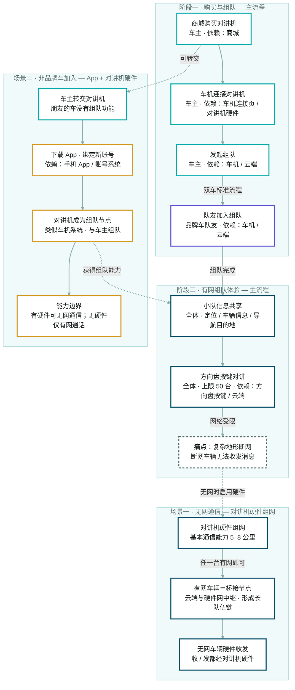
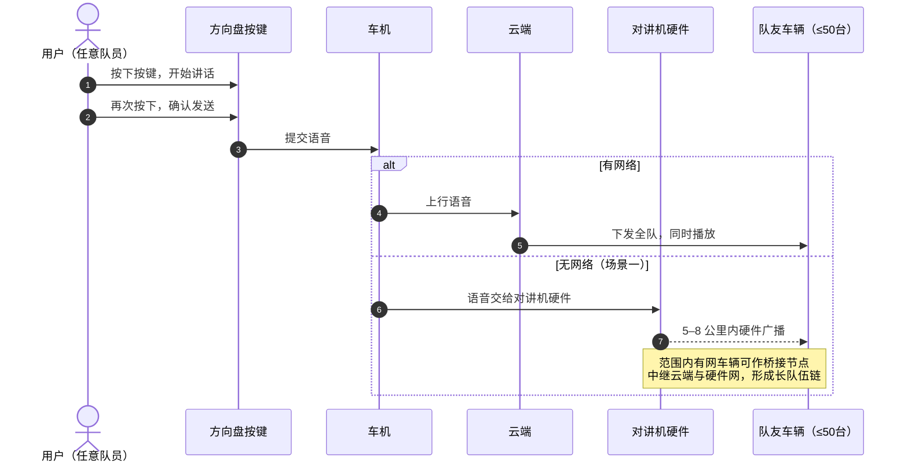

# 对讲机组队功能 · 用户流程图（Mermaid 版）

依据《对讲机组队功能及无网场景解决方案介绍》（2026-07-31），按 **用户类型 — 使用场景 — 依赖端/系统** 三维拆解。
节点边框色区分用户类型：**青色＝车主（发起人）**，**紫色＝品牌车队友**，**琥珀色＝非品牌车朋友**，**深青色＝全体成员**；灰色为痛点节点。

## 总览流程



## 对讲发送时序（补充）

有网走云端、无网走硬件的一次语音发送过程：



## Mermaid 源码（可直接复制）

粘贴到任何支持 Mermaid 的地方（GitHub / 飞书 / Notion / 语雀等）即可使用：

```text
flowchart TB
  subgraph SA["阶段一 · 购买与组队 — 主流程"]
    direction LR
    n1["商城购买对讲机<br/>车主 · 依赖：商城"]
    n2["车机连接对讲机<br/>车主 · 依赖：车机连接页 / 对讲机硬件"]
    n3["发起组队<br/>车主 · 依赖：车机 / 云端"]
    n4["队友加入组队<br/>品牌车队友 · 依赖：车机 / 云端"]
    n1 --> n2 --> n3 -- 双车标准流程 --> n4
  end
  subgraph SB["阶段二 · 有网组队体验 — 主流程"]
    direction LR
    n5["小队信息共享<br/>全体 · 定位 / 车辆信息 / 导航目的地"]
    n6["方向盘按键对讲<br/>全体 · 上限 50 台 · 依赖：方向盘按键 / 云端"]
    n7["痛点：复杂地形断网<br/>断网车辆无法收发消息"]
    n5 --> n6 -- 网络受限 --> n7
  end
  subgraph SC["场景一 · 无网通信 — 对讲机硬件组网"]
    direction LR
    n8["对讲机硬件组网<br/>基本通信能力 5–8 公里"]
    n9["有网车辆＝桥接节点<br/>云端与硬件网中继 · 形成长队伍链"]
    n10["无网车辆硬件收发<br/>收 / 发都经对讲机硬件"]
    n8 -- 任一台有网即可 --> n9 --> n10
  end
  subgraph SD["场景二 · 非品牌车加入 — App + 对讲机硬件"]
    direction LR
    n11["车主转交对讲机<br/>朋友的车没有组队功能"]
    n12["下载 App · 绑定新账号<br/>依赖：手机 App / 账号系统"]
    n13["对讲机成为组队节点<br/>类似车机系统 · 与车主组队"]
    n14["能力边界<br/>有硬件可无网通信；无硬件仅有网通话"]
    n11 --> n12 --> n13 --> n14
  end
  n4 -- 组队完成 --> n5
  n7 -. 无网时启用硬件 .-> n8
  n1 -. 可转交 .-> n11
  n13 -. 获得组队能力 .-> n5
  classDef owner fill:#FFFFFF,stroke:#00AAAA,stroke-width:2.5px,color:#1A1F1F
  classDef mate fill:#FFFFFF,stroke:#5D4DD4,stroke-width:2.5px,color:#1A1F1F
  classDef frnd fill:#FFFFFF,stroke:#D49922,stroke-width:2.5px,color:#1A1F1F
  classDef team fill:#FFFFFF,stroke:#004b64,stroke-width:2.5px,color:#1A1F1F
  classDef pain fill:#FFFFFF,stroke:#5C7070,stroke-width:2.5px,stroke-dasharray:5 4,color:#1A1F1F
  class n1,n2,n3,n11 owner
  class n4 mate
  class n5,n6,n8,n9,n10 team
  class n7 pain
  class n12,n13,n14 frnd
  style SA fill:#F0FAFA,stroke:#B8DEDE,stroke-width:1.5px,color:#5C7070
  style SB fill:#F0FAFA,stroke:#B8DEDE,stroke-width:1.5px,color:#5C7070
  style SC fill:#F0FAFA,stroke:#B8DEDE,stroke-width:1.5px,color:#5C7070
  style SD fill:#F0FAFA,stroke:#B8DEDE,stroke-width:1.5px,color:#5C7070
  linkStyle default stroke:#8AABAB,stroke-width:2px
```

---

**关键约束（摘自原文）**：对讲上限 50 台车同时收播 · 对讲机硬件基本通信能力 5–8 公里 · 无网通信要求车辆配备对讲机硬件 · 桥接需要范围内至少一台有网车辆。
